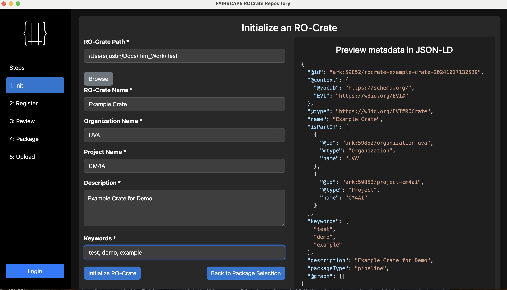

# FAIRSCAPE GUI Client Instructions

## 1. Getting Started: Package and Publish Research Objects

The FAIRSCAPE GUI client allows you to package and publish research objects as Research Object Crates (RO-Crate). The opening interface presents the following steps:

- Step 0: Prep Folder for RO-Crate Initialization
- Step 1: Initialize an RO-Crate
- Step 2: Register files in your RO-Crate
- Step 3: Review the contents of your RO-Crate
- Step 4: Package an RO-Crate for upload
- Step 5: Upload an RO-Crate

You can select any of these steps to begin the process. For a new RO-Crate, start with Step 0.

## 2. Initializing an RO-Crate

To initialize a new RO-Crate:

1. Provide the RO-Crate Path
2. Enter the RO-Crate Name (e.g., Example Crate)
3. Specify the organization name from the dropdown list
4. Enter the Project Name (e.g., CM4AI)
5. Provide a Description (e.g., Example Crate for Demo)
6. Add relevant Keywords (e.g., test, demo, example)

The right panel shows a preview of the metadata in JSON-LD format, which updates as you fill in the form.

## 3. Registering Objects

After initialization, you'll see a list of files available for registration in your RO-Crate. In this example, the files are:

- input_data.csv
- output_data.csv
- software.py

Select a file to add metadata for each object.

## 4. Adding Metadata to Objects

For each file, you'll need to provide metadata:

1. Dataset Name (e.g., input data)
2. Author (e.g., Smith John)
3. Version (e.g., 1.0)
4. Date Published (e.g., 10/17/2024)
5. Description (e.g., Example Input Dataset)
6. Keywords (e.g., test)
7. Data Format (e.g., CSV)

## 5. Completing Object Registration

After adding metadata to all files:

1. You'll see green checkmarks next to each registered file.
2. Click "Done Registering" to complete the process.

## 6. Recording Computation

To record a computation:

1. Enter the Computation Name (e.g., Example Computation)
2. Specify the Date Created (e.g., 10/17/2024)
3. Provide the name of who Run By the computation (e.g., Smith John)
4. Add relevant Keywords (e.g., python)
5. Give a Description of the computation (e.g., Simple computation)

Below the form, you'll see sections for:

- Available Files
- Input Datasets
- Output Datasets
- Software Used

You can drag and drop files from the Available Files section to the appropriate categories.

## 7. Previewing RO-Crate Contents

After recording all necessary information:

1. You'll see a table view of all the contents in your RO-Crate.
2. The table includes columns for Name, Status, Type, and GUID (Globally Unique Identifier).
3. All items should have a "Registered" status.
4. You can switch between "Table View" and "JSON-LD View" to see different representations of your data.
5. Click "Continue to Package" when you're satisfied with the contents.

## 8. Packaging RO-Crate

To package your RO-Crate:

1. Verify the RO-Crate Path is correct.
2. Click "Process and Package RO-Crate" to begin the packaging process.

## 9. Uploading RO-Crate

Finally, to upload your packaged RO-Crate:

1. Ensure you're logged in to the FAIRSCAPE ROCrate Repository.
2. The packaged RO-Crate file name will be displayed (e.g., Test.zip).
3. Click "Upload RO-Crate" to begin the upload process.
4. Track the upload progress with the status bar!

Congratulations! You've successfully created, packaged, and uploaded an RO-Crate to the FAIRSCAPE Repository.
