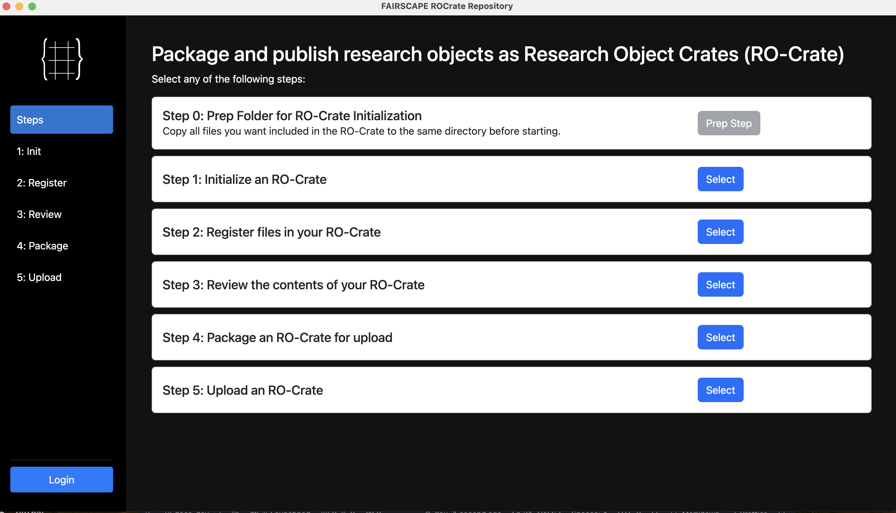
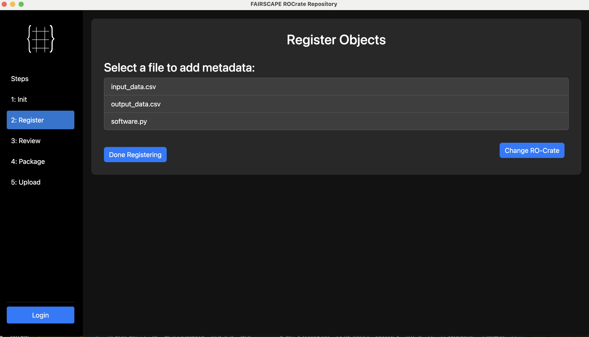
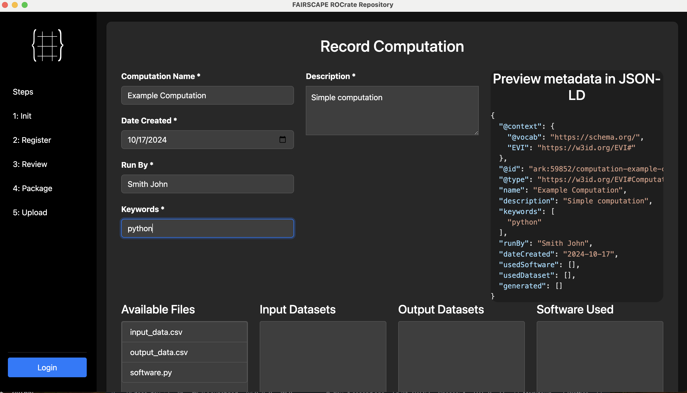
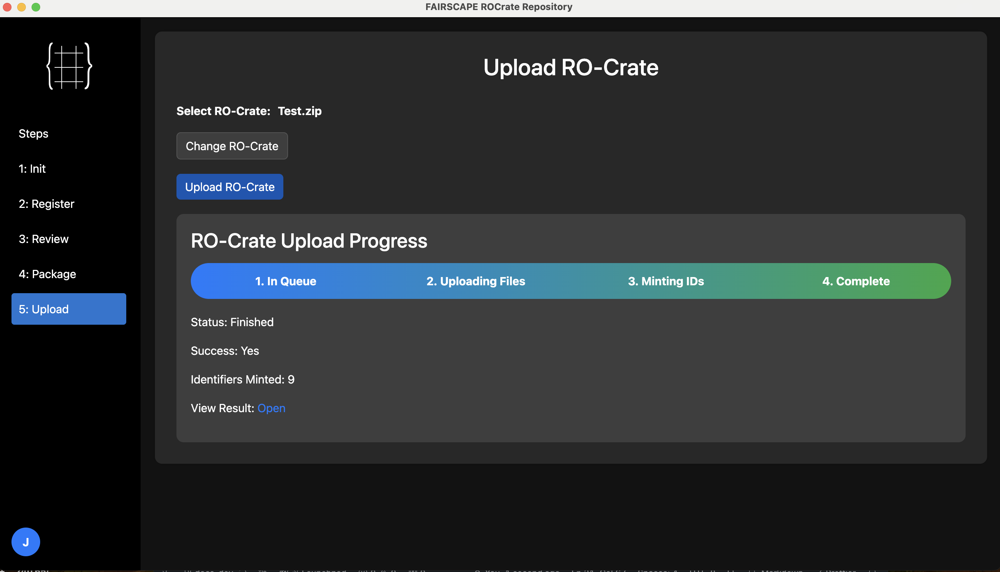

# Step-by-step tutorial for creating and publishing an RO-Crate

## 1. Getting Started: Preparation and steps

The client interface contains five interactive steps for creating and publishing RO-Crates. Only authorized users are allowed to publish the RO-Crates to the FAIRSCAPE server after logging in. While RO-Crates can be created and packaged in a local machine in isolation, internet connection is required when a user is ready to connect to the server and publish them. Internet connection is required only when a user is ready to publish. The opening interface shows the following steps:

- Step 0: Prep Folder for RO-Crate Initialization
- Step 1: Initialize an RO-Crate
- Step 2: Register files in your RO-Crate
- Step 3: Review the contents of your RO-Crate
- Step 4: Package an RO-Crate for upload
- Step 5: Upload an RO-Crate

Select any of these steps to begin the process. For creating a new RO-Crate, begin by moving all the data and software you'd like to package to a single folder (step 0).

## 2. Initializing an RO-Crate

To initialize a new RO-Crate:

1. Provide the RO-Crate Path
2. Enter the RO-Crate Name (e.g., Example Crate)
3. Specify the organization name from the dropdown list
4. Enter the Project Name (e.g., CM4AI)
5. Provide a Description (e.g., Example Crate for Demo)
6. Add relevant Keywords (e.g., test, demo, example)

The right panel shows a preview of the metadata in JSON-LD format, which updates as you fill in the form.

## 3. Registering Objects

After initialization, a list of files will be available for registration in your RO-Crate. In this example, the files are:

- input_data.csv
- output_data.csv
- software.py

Select a file to add metadata for each object.

## 4. Adding Metadata to Objects

For each file, the following set of metadata must be provided:

1. Dataset Name (e.g., input data)
2. Author (e.g., Smith John)
3. Version (e.g., 1.0)
4. Date Published (e.g., 10/17/2024)
5. Description (e.g., Example Input Dataset)
6. Keywords (e.g., test)
7. Data Format (e.g., CSV)

## 5. Completing Object Registration

Once metadata are provided for all files:

1. A green checkmark will appear next to each registered file
2. Complete the registration step by clicking "Done Registering".

## 6. Recording Computation

To record a computation:

1. Enter the Computation Name (e.g., Example Computation)
2. Specify the Date Created (e.g., 10/17/2024)
3. Provide the name of who Run By the computation (e.g., Smith John)
4. Add relevant Keywords (e.g., python)
5. Give a Description of the computation (e.g., Simple computation)

There are 4 placeholders:

- Available Files (registered files only)
- Input Datasets
- Output Datasets
- Software Used

Drag and drop files from the `Available Files` section to the appropriate categories.

## 7. Previewing RO-Crate Contents

The `Review` step allows users to examine and verify all the metadata recorded in the previous steps. It offers two viewing options:

### 1. Table View

This view presents the RO-Crate contents in a tabular format with the following columns:

- **Name**: Displays the name or title of each item in the RO-Crate
- **Status**: Shows the current status of each item, typically "Registered" if properly added
- **Type**: Indicates the type of content (e.g., dataset, file, person)
- **GUID** (Globally Unique Identifier): Presents a unique identifier for each item

### 2. JSON-LD View

This view shows the RO-Crate metadata in JSON-LD format. It provides:

- A machine-readable representation of the RO-Crate metadata
- Detailed semantic information about the relationships between items

Users can switch between these views to gain different perspectives on their RO-Crate contents. Once satisfied with the review, users can proceed to the RO-Crate packaging step.

## 8. Packaging RO-Crate

To package your RO-Crate:

1. Verify the RO-Crate Path is correct.
2. To package the RO-Crate:

## 9. Uploading RO-Crate

Finally, to upload your packaged RO-Crate:

1. Ensure you're logged in to the FAIRSCAPE ROCrate Repository.
2. The packaged RO-Crate file name will be displayed (e.g., Test.zip).
3. Click "Upload RO-Crate" to begin the upload process.
4. Track the upload progress with the status bar!

Congratulations! You've successfully created, packaged, and uploaded an RO-Crate to the FAIRSCAPE Repository.
