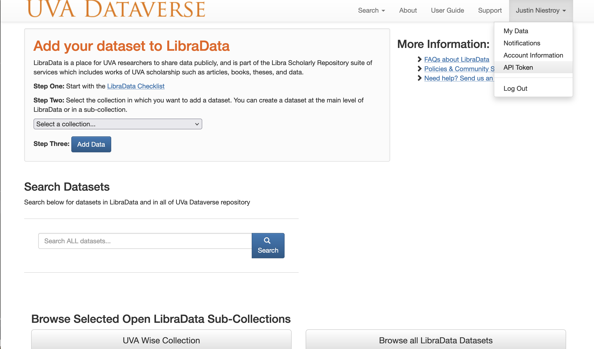
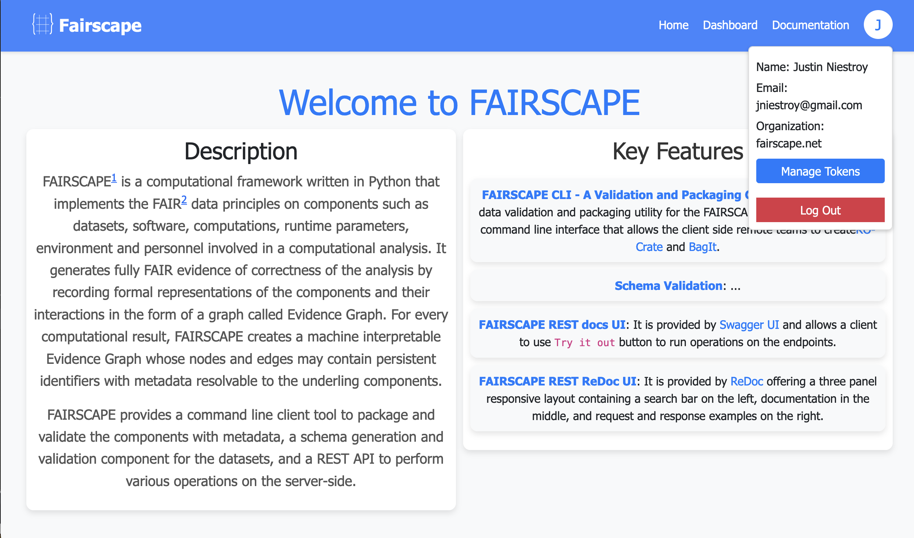
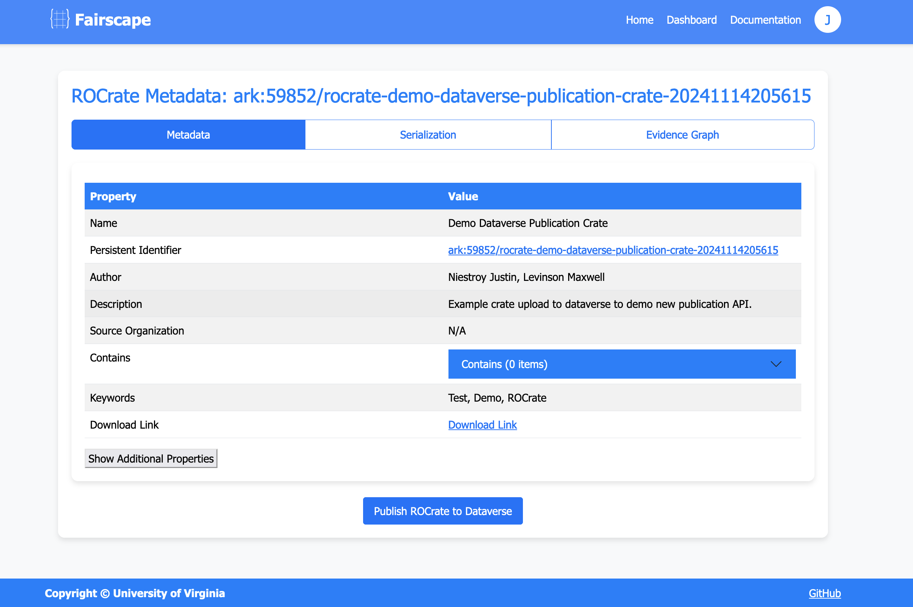

<!-- markdownlint-disable -->

# Publishing ROCrate to Dataverse: A Step-by-Step Guide

## 1. Generate Dataverse API Token

1. Log in to your Dataverse account. [UVA Dataverse](https://dataverse.lib.virginia.edu/)
2. Click on your username in the top right corner
3. Select "API Token" from the dropdown menu
4. Click "Create Token" if you don't have one already
5. Copy the generated API token for future use

## 2. Configure Fairscape Token Management

1. Log in to Fairscape server [here](https://fairscape.net/login)
2. Click "Manage Tokens" in the top navigation
3. Fill in the required fields:
    * Token ID (e.g., "My UVA Dataverse Token")
    * Endpoint URL (The Dataverse instance you are uploading to e.g.,"https://dataverse.uva.edu")
    * Token Value (paste your Dataverse API token)
4. Click "ADD TOKEN" to save
   

## 3. Navigate to RO-Crate Publication

1. Go to your ROCrate metadata page in Fairscape
2. Click the "Publish ROCrate to Dataverse" button at the bottom of the page

## 4. Complete Publication Form

The required fields are auto-populated, but you can edit them as needed (marked with \*):

1. Select Dataverse Instance from the dropdown
    * Choose your configured Dataverse instance
2. Database Configuration:
    * Confirm Database Name (default: "libradata")
3. Publication Details:
    * Title\*: Verify or update the ROCrate title
    * Authors\*: Edit/Add all relevant authors
    * Description\*: Review and update as needed
    * Keywords\*: Confirm or modify keywords
    * Publication Date\*: Verify the date is correct

## 5. Publish ROCrate

1. Final Review:
    * Double-check all entered information
    * Ensure all required fields are completed
    * Verify Dataverse instance selection
2. Publication:
    * Click "Publish to Dataverse" button
    * Wait for the publication process to complete
